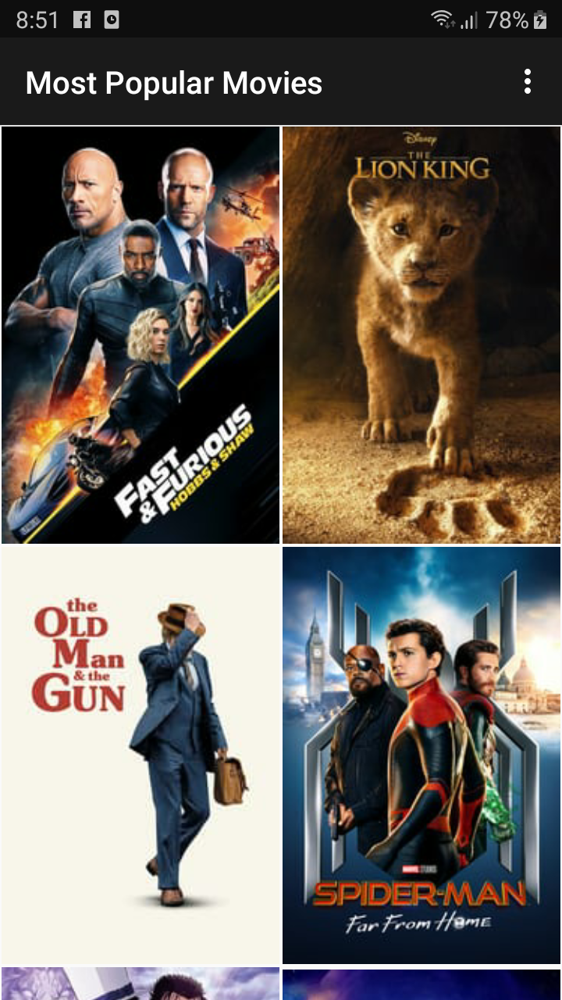

# Popular Movies Android Application

This Android application is a part of the Developing Android Apps
course on Udacity. This project provides information for movies.
The application retrieves moves from IMDB database for two categories:
Most Popular and Top Movies.

The user can mark the movies as favorite. The application stores user's 
selected movies to a local DB. The user can browse favorite movies as
well as top and popular movies.

The application provides links to movie trailers and shows users' 
reviews.

## Purpose of the Project

The main purpose of this project is to learn Android Android app 
development. In particular, use of Android Architecture Components 
(Room, LiveData, ViewModel and Lifecycle) to create a robust an 
efficient application.

## Outcome of the Project

The final result of the project is a fully featured application that 
looks and feels natural on the latest Android operating system.

## Screenshots

Here are a few screenshots that show the movie grid and movie details:

|||

The movie grid is customized based on the screen size and orientation. 
The movies can be sorted from the main menu: 

## Usage Details

To use the project, please open it in Android Studio and build by
following general Android Application build instructions.

Please update gradle.properties with an API keys from themoviedb.org.

## Contribution

This is a learning project. It is open for comments and suggestions.
This project is not intended for code contributions.

## License

This code is distributed under [MIT license](https://opensource.org/licenses/MIT).

Copyright (c) [2019] [Mykola Dzyuba]

Permission is hereby granted, free of charge, to any person obtaining a copy
of this software and associated documentation files (the "Software"), to deal
in the Software without restriction, including without limitation the rights
to use, copy, modify, merge, publish, distribute, sublicense, and/or sell
copies of the Software, and to permit persons to whom the Software is
furnished to do so, subject to the following conditions:

The above copyright notice and this permission notice shall be included in all
copies or substantial portions of the Software.

THE SOFTWARE IS PROVIDED "AS IS", WITHOUT WARRANTY OF ANY KIND, EXPRESS OR
IMPLIED, INCLUDING BUT NOT LIMITED TO THE WARRANTIES OF MERCHANTABILITY,
FITNESS FOR A PARTICULAR PURPOSE AND NONINFRINGEMENT. IN NO EVENT SHALL THE
AUTHORS OR COPYRIGHT HOLDERS BE LIABLE FOR ANY CLAIM, DAMAGES OR OTHER
LIABILITY, WHETHER IN AN ACTION OF CONTRACT, TORT OR OTHERWISE, ARISING FROM,
OUT OF OR IN CONNECTION WITH THE SOFTWARE OR THE USE OR OTHER DEALINGS IN THE
SOFTWARE.
